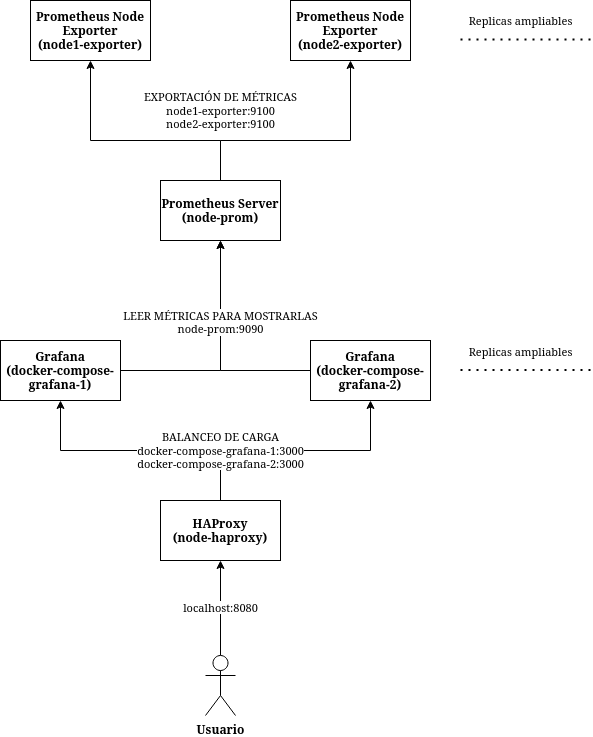

# Práctica 1

Jose Luis Gallego Peña (Grupo de prácticas 1) [:octocat:](https://github.com/jlgallego99)

## Descripción de la práctica y problema a resolver
El diseño de servicios interconectados y desplegados en la nube es algo esencial en el paradigma Cloud Computing. Es por eso que esta práctica consiste en el despliegue de una serie de contenedores Docker que permitan a su vez desplegar unos servicios con los que monitorizar un sistema. El objetivo es conseguir un ecosistema de servicios que atienda a las demandas del Cloud: que sea escalable, tolerante a fallos, flexible y con una alta disponibilidad, de forma que pueda funcionar correctamente o arreglarse fácilmente siempre incluso si hay algún fallo en alguna de las partes.

Se ha resuelto este problema de composición y despliegue de contenedores de dos maneras: una primera manera usando solo contenedores docker con un script sin orquestador y una segunda usando un orquestador como es docker-compose. En ambos casos se provee de un único fichero de configuración con todo lo necesario para desplegar todos los contenedores y ponerlos en funcionamiento rápidamente.

Estos servicios deben permitir la captura de métricas así como la exportación, publicación y visualización de estas en un nodo a monitorizar. Todo ello con alta disponibilidad en el servicio que nos permite visualizarlas. En el próximo apartado se profundizará en cuales son estos servicios, cómo funcionan, cómo están configurados y la manera de ejecutarlos.

## Servicios desplegados y su configuración (Aquí explica el método para desplegar que has usado y como lo has hecho incluyendo todos los detalles necesarios)
Se han configurado para desplegar en total 6 contenedores con las siguientes características:
- Un contenedor

Los contenedores y servicios que se tienen, así como sus conexiones, están resumidas en la siguiente imagen que indica además con que hostname y puerto acceden entre sí. La flecha indica la dirección en la que se conectan los contenedores. Todos los contenedores quedan desplegados en una red común en la que pueden referirse entre ellos mediante su nombre en lugar de con una dirección IP.



### Desplegar servicios con docker sin orquestador
Ejecutar el script del shell llamado "contenedores_docker.sh" de la siguiente manera (es necesario tener instalado docker y bash para ejecutar el script del shell): ```./contenedores_docker.sh```
### Desplegar servicios con docker-compose
Ejecutar el fichero de descripción de servicios de compose de la siguiente manera (es necesario tener instalado docker y docker-compose): ```docker-compose up```

## Conclusiones

## Referencias bibliográficas y recursos utilizados