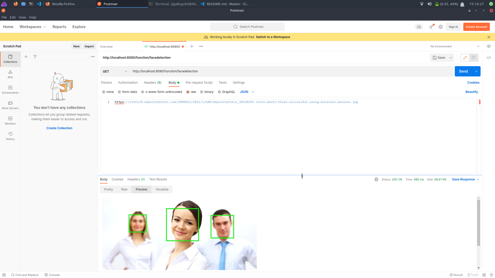

# Práctica 2

Realizada por Jose Luis Gallego Peña (Grupo de prácticas 1) [:octocat:](https://github.com/jlgallego99)

## Descripción de la práctica y problema a resolver
El objetivo de esta práctica es construir y desplegar un cluster de Kubernetes de forma sencilla y eficaz con el cual desplegar una función como servicio que sea escalable, usando un servicio como Openfaas. Esta función como servicio recibirá una URL de una imagen y la procesará para devolver esa misma imagen pero habiendo detectado las caras y dibujando un rectángulo alrededor de ellas. Se busca que esta función se pueda acceder desde una URL y por tanto sea independiente del lenguaje de programación en el que esté implementada, dando una introducción al paradigma de las funciones como servicio.

## Instalación de Microk8s y Openfaas
Se ha optado por desplegar Openfaas en un cluster de Kubernetes, en concreto en Microk8s debido a su facilidad para instalar y usar kubernetes junto a openfaas de forma rápida, sencilla y escalable. Para ello se ha instalado primero microk8s en nuestra máquina, usando para ello snap, que tiene un paquete de microk8s listo para instalar y poner en funcionamiento con la siguiente orden del terminal:
```
sudo snap install microk8s --classic
```
Tras hacer esto, el servicio de microk8s se puede iniciar con:
```
microk8s start
```
Sin embargo ahora necesitamos instalar algunos addons que nos permitan usar el cluster de mejor forma, principalmente los addons del servicio dns, el dashboard (para ver mejor los servicios que tenemos) y storage por si se necesitase almacenar algo. Además de esto, por supuesto, instalamos el addon de Openfaas, que ya viene en microk8s y con una sola orden podemos tenerlo instalando y funcionando. Con la siguiente orden lo instalamos todo:
```
microk8s enable communityH
microk8s enable dns dashboard storage openfaas
```
Ahora, si ejecutamos la orden 
```
microk8s kubectl get all --namespace=openfaas
```
Vemos todos los pods que tiene nuestro cluster de Openfaas en Kubernetes. En concreto nos interesa el servicio gateway de NodePort, que es el que tiene la interfaz de usuario de Openfaas. Ahí se nos indica una dirección IP y un puerto, pero sin embargo es más comodo tenerlo en localhost en lugar de en una dirección IP extraña, por lo que simplemente hace falta redirigir la IP del contenedor a nuestro localhost con la siguiente orden:
```
sudo microk8s kubectl port-forward -n openfaas svc/gateway 8080:8080
``` 

Con esto ya podríamos acceder a http://localhost:8080/ui que es la interfaz gráfica de nuestro servicio Openfaas. Sin embargo hay un problema, necesitamos un nombre de usuario y contraseña para iniciar sesión en el servicio de Openfaas. El nombre es por defecto admin, y la contraseña está almacenada dentro del cluster, y para acceder a ella podemos ejecutar la siguiente orden:
```
microk8s kubectl get secret -n openfaas basic-auth -o jsonpath="{.data.basic-auth-password}" | base64 --decode; echo
```
que nos dará en el terminal la contraseña, que copiamos y pegamos donde nos pide openfaas.

Antes de desplegar la función en openfaas, hay que tener instalado faas-cli en el sistema, la herramienta para poder construir y desplegar funciones faas. Entonces debemos hacer login en el servicio openfaas, usando la anterior contraseña de la siguiente manera:
```
faas-cli login admin --password $(microk8s kubectl get secret -n openfaas basic-auth -o jsonpath="{.data.basic-auth-password}" | base64 --decode; echo)
```

Ahora sí, ya podemos empezar a desarrollar y desplegar funciones de openfaas. Una vez que tengamos hecha una, hay que seguir siempre la siguiente secuencia de ordenes para tenerla subida y funcionando, estando en la raíz del proyecto:
```
sudo faas-cli build -f facedetection.yml
faas-cli push -f facedetection.yml
faas-cli deploy -f facedetection.yml
```
Estas tres ordenes usan el mismo fichero de configuración yml de la función, que es la parte más importante de la función faas. 

En el fichero yml se describe el nombre de la función, la URL donde se encuentra activo el servicio Openfaas (en nuestro caso, el puerto 8080 de localhost), el lenguaje y template para la programación de la función y la imagen que se construirá y usará para desplegar como contenedor la función, siendo encapsulada y conteniendo todo lo necesario para funcionar. En este caso, la función se desplega en un contenedor docker que se sube a mi propia cuenta de Dockerhub, pudiendo acceder a ese contenedor desde cualquier lugar con acceso a internet. Por tanto, las ordenes anteriores lo que hacen es, en orden: construir la imagen a partir de la template, subirla a Dockerhub, y desplegar la función en el servicio Openfaas. El servicio Openfaas cogerá la imagen directamente de Dockerhub para desplegarla.

## Implementación de la función como servicio
Para la implementación de la función como servicio se ha usado el lenguaje Python por su facilidad en la implementación y la buena integración que tiene con la biblioteca OpenCV, con la cual se pueden detectar caras en una imagen.

Como se puede ver en el fichero [de descripción de la función](facedetection.yml), se usa una template llamada python3-debian. La template nos permite construir una imagen Docker válida para Openfaas, y hay muchas en función del lenguaje y lo que se busque hacer. Se ha elegido esta en concreto, en lugar de la template básica de python, por varias razones. La principal es que esta usa una imagen de debian, con la que es mucho más facil instalar todas las bibliotecas que necesita OpenCV, ha bastado únicamente con añadir en la parte del Dockerfile en la que se instalan paquetes (con sudo apt install) el paquete python3-opencv. Pero además esta template nos permite usar python en su última versión, que es mucho más preferible que la versión 2, ya descontinuada.

Además de la descripción de la función y la template, tenemos un directorio llamado facedetection donde se encuentra todo lo necesario para la función. Por un lado tenemos el archivo requirements.txt, donde instalamos las bibliotecas necesarias (opencv y requests, con la que descargar imagenes de una URL), por otro lado tenemos el archivo facedetection.py, que es el código de la función con su implementación. Además de esto tenemos un último fichero en formato XML, que es una descripción del algoritmo de detección de caras que necesita OpenCV para poder funcionar, dentro del código python se carga este fichero.

Una vez visto la estructura y el cometido de todos los ficheros, podemos pasar a explicar la implementación de la función:
```python
import cv2
import requests
import numpy as np
import base64

xmlFile = "haarcascade_frontalface_default.xml"

def handle(req):
    # Create the haar cascade
    faceCascade = cv2.CascadeClassifier(cv2.data.haarcascades + xmlFile)

    # Get the image from an URL
    imgBytes = requests.get(req).content
    arr = np.asarray(bytearray(imgBytes), dtype=np.uint8)
    img = cv2.imdecode(arr, -1) # 'Load it as it is'
    gray = cv2.cvtColor(img, cv2.COLOR_BGR2GRAY)

    # Detect faces in the image
    faces = faceCascade.detectMultiScale(
        gray,
        scaleFactor=1.1,
        minNeighbors=5,
        minSize=(30, 30),
        flags = cv2.CASCADE_SCALE_IMAGE
    )

    #print("Found {0} faces!".format(len(faces)))
    #return str(len(faces))

    # Draw a rectangle around the faces
    for (x, y, w, h) in faces:
        cv2.rectangle(img, (x, y), (x+w, y+h), (0, 255, 0), 2)

    jpg_img = cv2.imencode('.jpg', img)
    b64_string = base64.b64encode(jpg_img[1]).decode('utf-8')

    return("")
```

Tenemos una única función llamada handle, que es la que se ocupa de todo el procesamiento de la función como servicio. Recibe un parámetro que es la URL de la imagen a la que queremos detectar caras, por lo que la leemos de la URL y descargamos en una variable que podamos manipular con OpenCV.

A continuación se pasa la imagen a escala de grises para poder detectar mejor las caras y se itera por todas las caras detectadas en la imagen para dibujar un rectángulo en ellas.

Finalmente se convierte la imagen a base64 y se devuelve una imagen en HTML que se muestra en la página web. Esto se ha hecho así porque no se ha encontrado una forma satisfactoria de devolver un fichero de imagen en la respuesta de la función, por lo que se ha optado por devolver una cabecera html de tipo imagen, con la que poder mostrar la imagen en una web. 

Para invocar esta función, podemos hacerlo desde Postman como se ve en la siguiente imagen:



En el cuerpo indicamos cualquier URL de internet de una imagen en la que salgan personas, y como resultado nos dará una etiqueta html con la imagen de las caras detectadas, que podemos ver en la pestaña Preview.


## Referencias bibliográficas y recursos utilizados
- [Tutorial de Canonical para instalar microk8s](https://ubuntu.com/tutorials/install-a-local-kubernetes-with-microk8s?&_ga=2.172496229.751247339.1654612435-1748137550.1650995611#1-overview)
- [Funciones de ejemplo de Openfaas](https://github.com/openfaas/faas/tree/master/sample-functions)
- [Tutorial de Opencv en Towardsdatascience](https://towardsdatascience.com/face-detection-in-2-minutes-using-opencv-python-90f89d7c0f81)